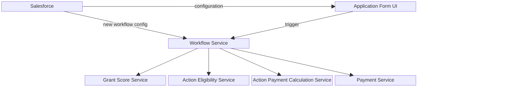

```mermaid
block-beta
    columns 6

    Salesforce
    space:3
    AppForm["Application Form UI"]
    space:15
    Workflow["Workflow Service"]
    space:16
    Grant["Grant Score Service"]
    Eligibility["Action Eligibility Service"]
    Calc["Action Payment Calculation Service"]
    Payments["Payment Service"]

    Salesforce --"configuration"--> AppForm
    Salesforce --"new workflow config"--> Workflow
    AppForm --"trigger"--> Workflow
    Workflow --> Grant
    Workflow --> Eligibility
    Workflow --> Calc
    Workflow --> Payments


```
