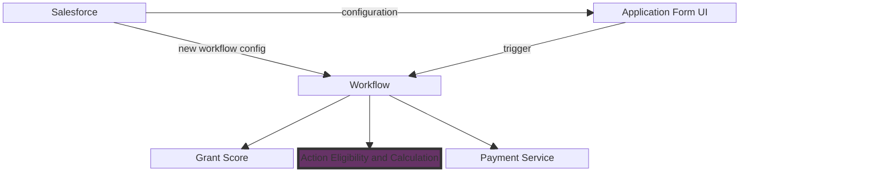

```mermaid
block-beta
    columns 6

    Salesforce
    space:3
    AppForm["Application Form UI"]
    space:15
    Workflow["Workflow"]
    space:16
    Grant["Grant Score"]
    Eligibility["Action Eligibility and Calculation"]
    Payments["Payment Service"]


    Salesforce --"configuration"--> AppForm
    Salesforce --"new workflow config"--> Workflow
    AppForm --"trigger"--> Workflow
    Workflow --> Grant
    Workflow --> Eligibility
    Workflow --> Payments

    style Eligibility padding:200px,fill:#636,stroke:#333,stroke-width:4px
```
