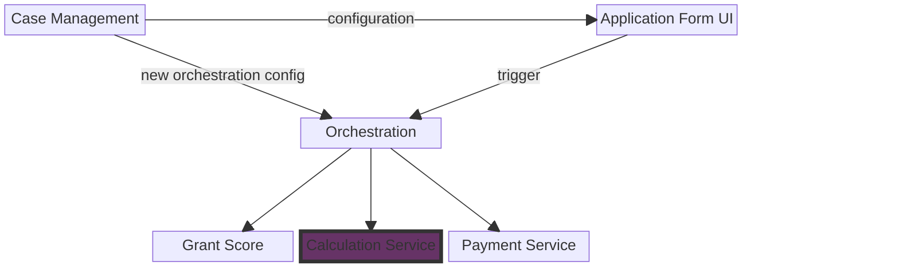
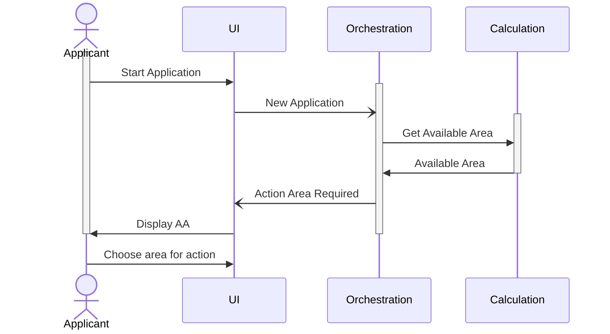
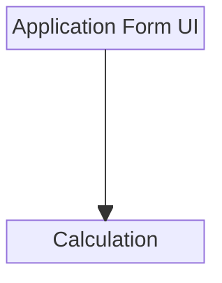
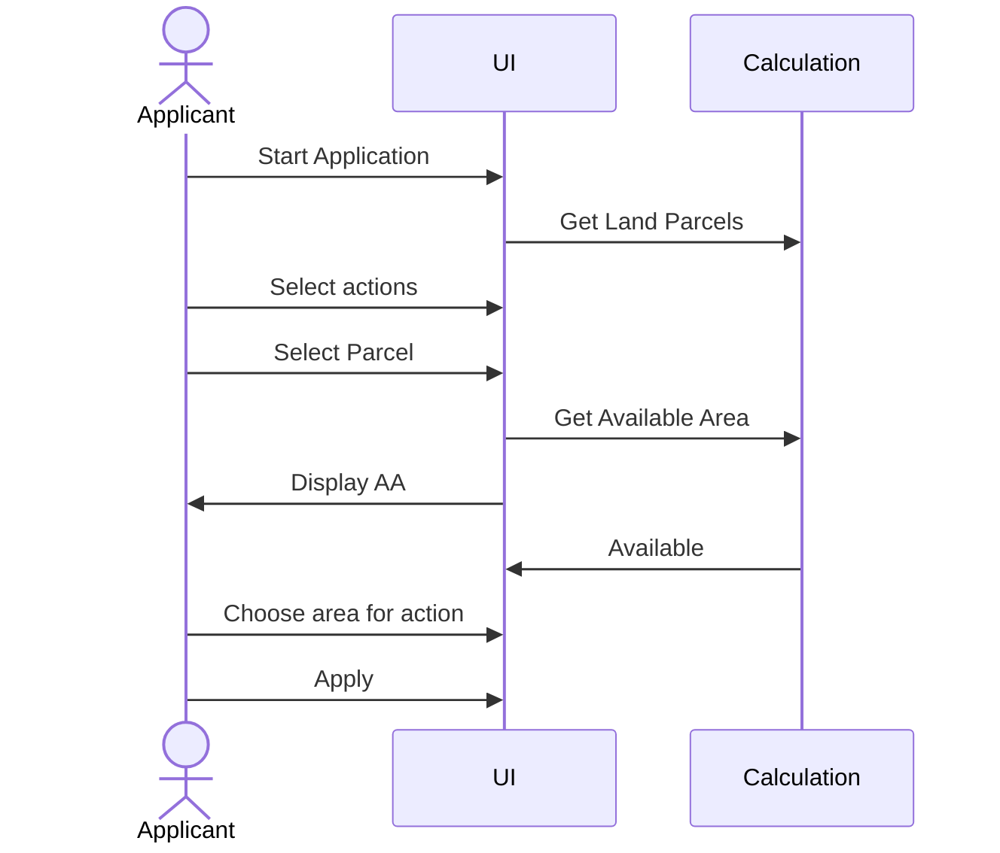

# Eventual
## Architecture

```mermaid
block-beta
    columns 6

    CaseManagement["Case Management"]
    space:3
    AppForm["Application Form UI"]
    space:15
    Orchestration["Orchestration"]
    space:16
    Grant["Grant Score"]
    Calculation["Calculation Service"]
    Payments["Payment Service"]


    CaseManagement --"configuration"--> AppForm
    CaseManagement --"new orchestration config"--> Orchestration
    AppForm --"trigger"--> Orchestration
    Orchestration --> Grant
    Orchestration --> Calculation
    Orchestration --> Payments

    style Calculation padding:200px,fill:#636,stroke:#333,stroke-width:4px
```

## Sequence

```mermaid
sequenceDiagram
actor Applicant
participant UI
participant Orchestration
participant Calculation
activate Applicant
Applicant->>UI: Start Application
activate Orchestration
UI-)Orchestration: New Application
activate Calculation
Orchestration->>Calculation: Get Available Area
Calculation->>Orchestration: Available Area
deactivate Calculation
Orchestration-)UI: Action Area Required
UI->>Applicant: Display AA 
deactivate Orchestration
deactivate Applicant
Applicant->>UI: Choose area for action 
```

# For demo
## Architecture

```mermaid
block-beta
    columns 1

    AppForm["Application Form UI"]
    space:3

    Calculation["Calculation"]

    AppForm ----> Calculation

```

## Sequence

```mermaid
sequenceDiagram
actor Applicant

Applicant->>UI: Start Application
UI->>Calculation: Get Land Parcels
Applicant->>UI: Select actions
Applicant->>UI: Select Parcel
UI->>Calculation: Get Available Area
UI->>Applicant: Display AA
Calculation->>UI: Available
Applicant->>UI: Choose area for action
Applicant->>UI: Apply

```
