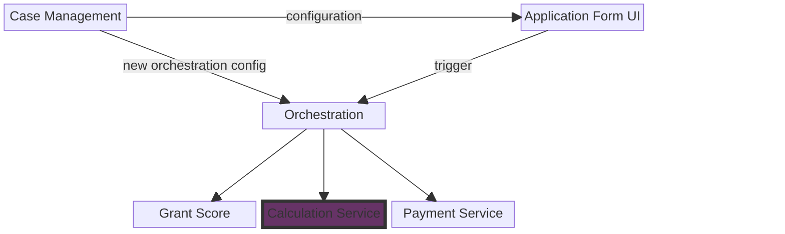
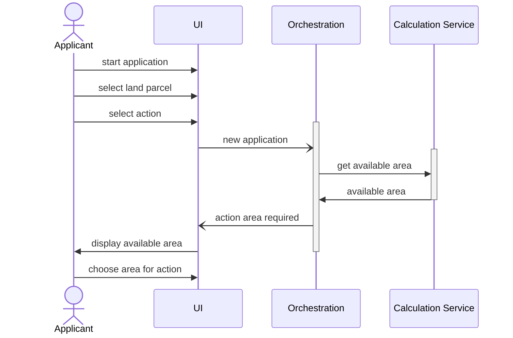
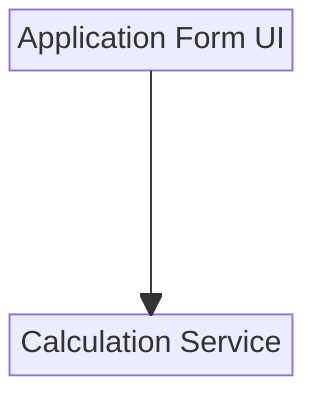
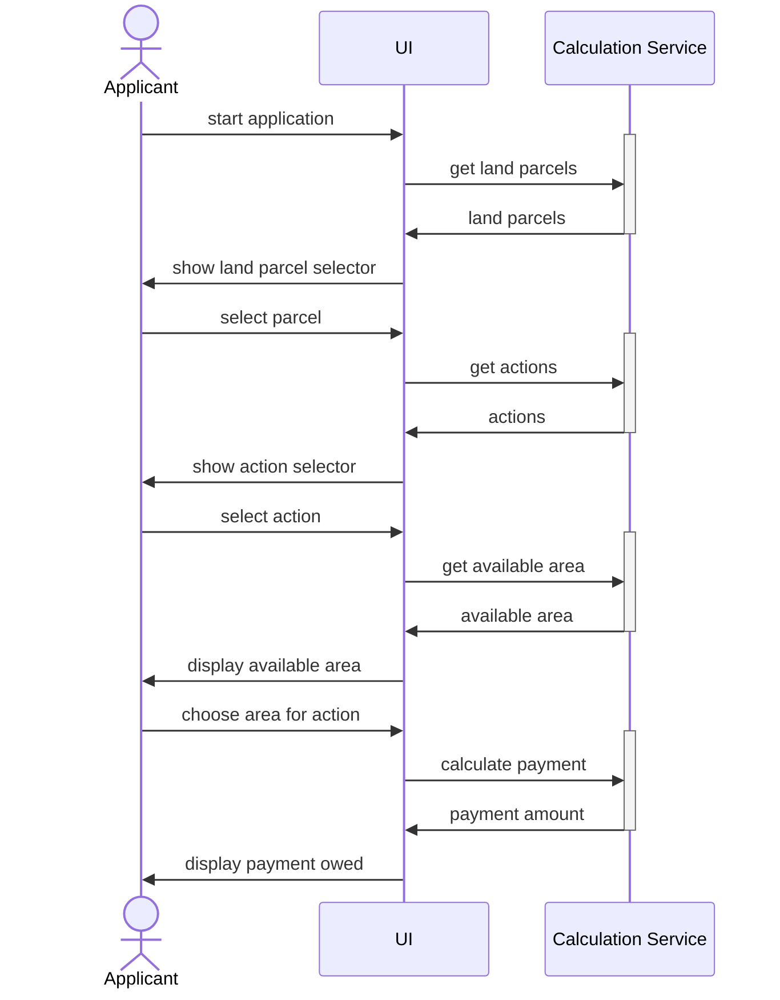

# Eventual
## Architecture

```mermaid
block-beta
    columns 6

    CaseManagement["Case Management"]
    space:3
    AppForm["Application Form UI"]
    space:15
    Orchestration["Orchestration"]
    space:16
    Grant["Grant Score"]
    Calculation["Calculation Service"]
    Payments["Payment Service"]


    CaseManagement --"configuration"--> AppForm
    CaseManagement --"new orchestration config"--> Orchestration
    AppForm --"trigger"--> Orchestration
    Orchestration --> Grant
    Orchestration --> Calculation
    Orchestration --> Payments

    style Calculation padding:200px,fill:#636,stroke:#333,stroke-width:4px
```

## Sequence

```mermaid
sequenceDiagram
actor applicant as Applicant
participant ui as UI
participant orchestration as Orchestration
participant calculation as Calculation Service

applicant->>ui: start application
applicant->>ui: select land parcel
applicant->>ui: select action 
activate orchestration
ui-)orchestration: new application
activate calculation
orchestration->>calculation: get available area
calculation->>orchestration: available area
deactivate calculation
orchestration-)ui: action area required
ui->>applicant: display available area 
deactivate orchestration
applicant->>ui: choose area for action 
```

# For PoC
## Architecture

```mermaid
block-beta
    columns 1

    AppForm["Application Form UI"]
    space:3

    Calculation["Calculation Service"]

    AppForm ----> Calculation

```

## Sequence

```mermaid
sequenceDiagram
actor applicant as Applicant
participant ui as UI
participant calculation as Calculation Service

applicant->>ui: start application

activate calculation
ui->>calculation: get land parcels
calculation->>ui: land parcels
deactivate calculation

ui->>applicant: show land parcel selector
applicant->>ui: select parcel

activate calculation
ui->>calculation: get actions
calculation->>ui: actions
deactivate calculation

ui->>applicant: show action selector
applicant->>ui: select action

activate calculation
ui->>calculation: get available area
calculation->>ui: available area
deactivate calculation

ui->>applicant: display available area
applicant->>ui: choose area for action

activate calculation
ui->>calculation: calculate payment 
calculation->>ui: payment amount
deactivate calculation

ui->>applicant: display payment owed
```
