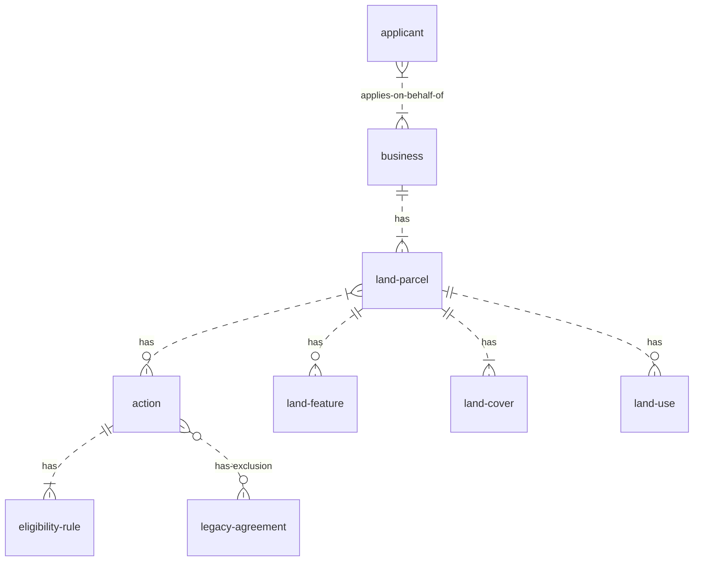

# Entities

## Business

A land owning organisation. This could be a farmer that owns their farm, a body that owns many areas
of land (e.g. National Trust) or others.

Identified internally using a DEFRA ID number, externally identified variously using SBI, FRN etc.
.

## Applicant

A person representing a business who is applying for an action. This person could be a farmer from
the business, an agent hired by the business or any other party authorised to apply on behalf of
them.

## Land parcel

An area of ground, defined by a map polygon on an Ordanance Survey base map, expressed in
[Define Units here].

## Land feature

## Land cover

## Land use

## Action

## Legacy agreement

## Eligibility rule

