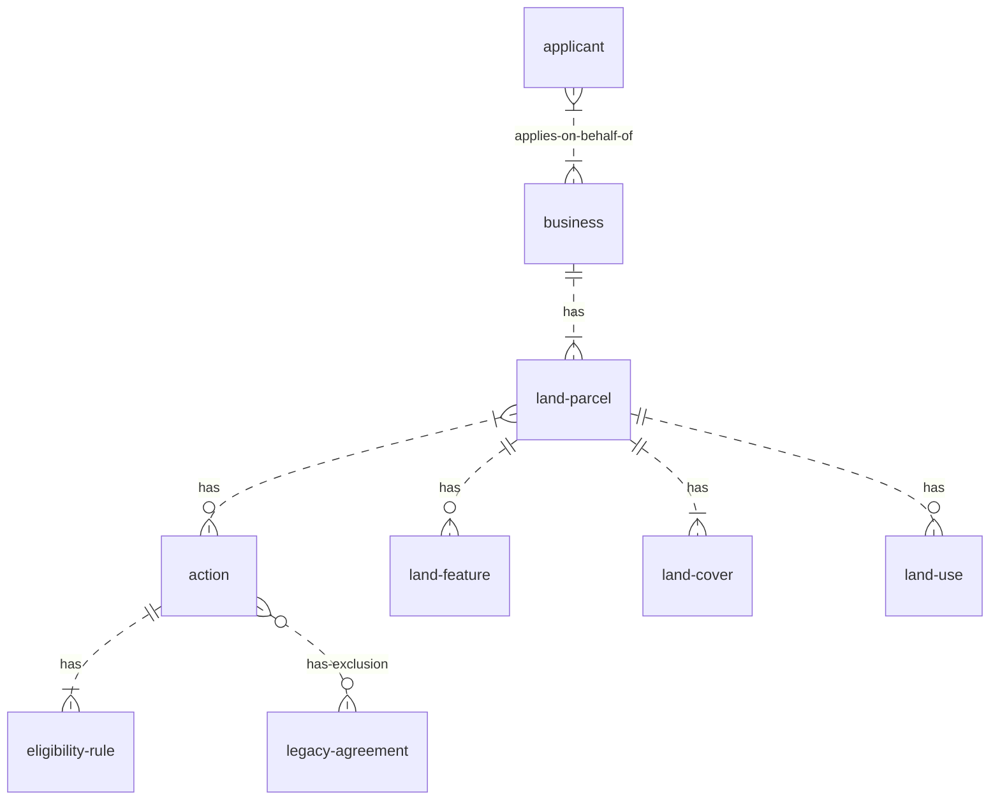

# Entities

## Business

A land owning organisation. This could be a farmer that owns their farm, a body that owns many areas
of land (e.g. National Trust) or others.

Identified internally using a DEFRA ID number, externally identified variously using SBI, FRN etc.
.

## Applicant

A person representing a business who is applying for an action. This person could be a farmer from
the business, an agent hired by the business or any other party authorised to apply on behalf of
them.

## Land parcel

An area of ground, defined by a map polygon on an Ordanance Survey base map, expressed in
[Define Units here].

## Land cover

The type of land e.g. arable, scrub, water body.

## Land feature

Something that can be said about a portion of the land parcel e.g. A barn is here.

## Land use

What the land is being used for e.g. growing corn. Like land cover but more specific.

## Action

A single action a farmer can take such as 'plant winter cover crop'. If the farmer does this, the
action has an associated payment rate.

## Legacy agreement

An existing (at the point of application) agreement for SfI, Countryside stewardship etc.

## Eligibility rule

A condition to determine if an applicant may apply for an action on a land parcel. The condition will
check things such as compatible land cover and compatibility with legacy agreements.

